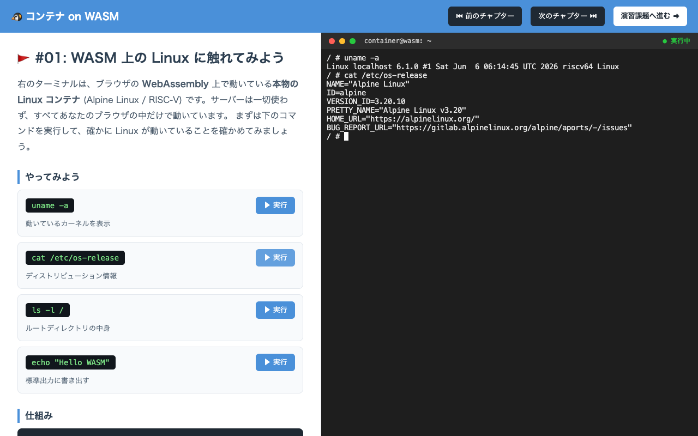

# container2wasm-demo — Docker コンテナを WASM に変換してブラウザで動かす

[container2wasm](https://github.com/ktock/container2wasm) (`c2w`) を使い、
**Ubuntu / Alpine などの Linux コンテナイメージを WebAssembly (WASI) に変換**して、
ブラウザの `xterm.js` ターミナル上でそのコンテナのシェルを動かすサンプルです。

「コンテナの中身を WASM に再コンパイル」するのではなく、
**CPU エミュレータごと WASM 化**し、その上で Linux カーネル + コンテナを起動する方式です
(x86_64 は Bochs、RISC-V は TinyEMU をエミュレータに使用)。

```
[Docker image]                 [out.wasm]                    [ブラウザ]
 riscv64/alpine  ──c2w──▶   TinyEMU(RISC-Vエミュ)   ──配信──▶  xterm.js 端末
 (or ubuntu)    (docker      + Linux kernel                    │
                 buildx)     + コンテナ rootfs                 ├─ worker.js (Web Worker)
                                                               │   └─ browser_wasi_shim (WASI 実装)
                                                               └─ xterm-pty (端末 I/O)
                                                                   ▲
                                            SharedArrayBuffer (COOP/COEP 必須) で同期 I/O
```



## 前提環境

| ツール | 用途 | 本デモでの確認版 |
|---|---|---|
| Docker | `c2w` が内部で `docker buildx` を使う | 27.5.1 |
| Go | `c2w` を macOS ネイティブにビルド (バイナリ非配布のため) | 1.24.6 |
| Node.js | COOP/COEP 付き配信サーバ (`serve.mjs`) | v23 |
| ブラウザ | `SharedArrayBuffer` 対応 (Chrome 推奨) | — |

> **macOS (arm64) の注意**: container2wasm は Linux バイナリしか配布していないため、
> 本デモでは Go でソースからネイティブビルドします (`build-c2w.sh` が自動化)。

## クイックスタート

```bash
# ビルド → 変換 → 配信 を一括実行 (既定: riscv64/alpine、軽量)
./run.sh

# ブラウザで http://127.0.0.1:8080/ を開く → コンテナのシェルが起動
```

初回は `c2w` のビルドと、エミュレータ + Linux カーネルのビルドが走るため時間がかかります。
**実測 (riscv64/alpine): 約 12 分・生成 `out.wasm` は約 52MB。**
2 回目以降は Docker のビルドキャッシュで高速になります。

## 画面構成 (2 ペイン演習 UI)

paiza.io のような **左=演習内容 / 右=WASM ターミナル**の 2 ペイン構成です。

```
[ヘッダー: タイトル / 前へ・次へ / 演習課題へ進む]
┌────────────────┬───────────────────────────┐
│ 左: 演習内容        │ 右: WASM ターミナル           │
│  ・チャプター説明    │  ● ● ●  container@wasm: ~  │
│  ・コマンドカード    │  / # uname -a               │
│    [code] [▶実行] │  Linux localhost 6.1.0 ...  │
│  ・仕組み(折りたたみ) │  riscv64 GNU/Linux          │
└────────────────┴───────────────────────────┘
```

左ペインの **「▶ 実行」ボタン**を押すと、そのコマンドが右の WASM ターミナルの
標準入力へ流し込まれて実行されます (`xterm.paste()` 経由)。
演習内容は [`htdocs/index.html`](htdocs/index.html) を編集して自由に差し替えられます。

## 個別手順

```bash
# 1. c2w をネイティブビルド (clone + Docker27 パッチ + go build)
./build-c2w.sh

# 2. コンテナイメージを WASM に変換 → htdocs/out.wasm
./convert.sh                       # 既定: riscv64/alpine:3.20

# 3. 配信 (COOP/COEP ヘッダ付き)
node serve.mjs                     # → http://127.0.0.1:8080/
```

## 別のイメージを変換する

```bash
# RISC-V の Ubuntu (推奨。TinyEMU で比較的軽い)
./convert.sh riscv64/ubuntu:22.04

# x86_64 の本物の Ubuntu (Bochs エミュ。動くが重く、wasm も大きい)
ARCH=amd64 ./convert.sh ubuntu:22.04
```

`ARCH` は変換先 CPU アーキ。`riscv64`(TinyEMU/軽量) / `amd64`(Bochs) / `aarch64`(QEMU) を選べます。
`riscv64` か `amd64` が推奨で、それ以外は QEMU の追加エミュレーションで低速になります。

## ディレクトリ構成

```
container2wasm-demo/
├── run.sh             # ビルド→変換→配信 を一括実行
├── build-c2w.sh       # container2wasm を clone して c2w をビルド (+Docker27 パッチ)
├── convert.sh         # イメージ → htdocs/out.wasm
├── serve.mjs          # COOP/COEP ヘッダを付与する Node 静的サーバ
├── bin/c2w            # ビルド済み c2w (darwin/arm64)
├── c2w-src/           # container2wasm v0.8.4 のソース (clone)
├── htdocs/            # ブラウザ配信ルート
│   ├── index.html     #   2 ペイン演習 UI (左=演習 / 右=WASM 端末。CDN→vendor 化済み)
│   ├── worker.js 他   #   WASI 実行ワーカー / 同期スタック
│   ├── browser_wasi_shim/  # WASI システムコール実装 (bjorn3/browser_wasi_shim)
│   ├── vendor/        #   xterm / xterm-pty / xterm-addon-fit をローカル化 (オフライン対応)
│   └── out.wasm       #   ★変換生成物 (ここに置かれたものをブラウザが fetch)
└── _ref/              # 公式 examples/wasi-browser の参照コピー
```

## 仕組みのポイント

- **変換 (`c2w`)**: BuildKit (`docker buildx`) で Dockerfile を実行し、
  エミュレータ (TinyEMU/Bochs) と Linux カーネルを `wasi-sdk` で WASM 化、
  コンテナ rootfs を `wasi-vfs` で同梱して 1 つの `out.wasm` にパッケージする。
- **ブラウザ実行**: `out.wasm` は WASI バイナリ。`browser_wasi_shim` が WASI を実装し、
  `xterm-pty` が端末 I/O を `xterm.js` に橋渡しする。
  ブロッキング stdin を実現するため Web Worker + `SharedArrayBuffer` を使う。
- **COOP/COEP**: `SharedArrayBuffer` は Cross-Origin Isolation が必須。
  公式は Apache の設定 (`xterm-pty.conf`) で付与するが、本デモは `serve.mjs` が
  `Cross-Origin-Opener-Policy: same-origin` /
  `Cross-Origin-Embedder-Policy: require-corp` を返して同じ役割を果たす。

## Docker 27 系での注意 (適用済みパッチ)

container2wasm v0.8.4 は変換時に `docker save --platform=linux/<arch>` を実行しますが、
`docker save` の `--platform` フラグは **Docker 28.0 で追加**されたため、
**27 系では `unknown flag: --platform` で失敗**します。

直前の `docker pull --platform` で既に目的アーキのイメージを取得しているので、
この `--platform` は安全に除去できます。`build-c2w.sh` が
[`cmd/c2w/main.go`](c2w-src/cmd/c2w/main.go) の該当行を自動でパッチします
(Docker 28 以降なら本パッチは不要)。

## (参考) CLI で動かす

ブラウザではなくコマンドラインで動かすには `wasmtime` 等の WASI ランタイムを使います。

```bash
wasmtime htdocs/out.wasm uname -a
wasmtime htdocs/out.wasm cat /etc/os-release
```

## ライセンス / 出典

- 変換ツール: [container2wasm](https://github.com/ktock/container2wasm) (Apache-2.0)
- 生成される `out.wasm` には Bochs / TinyEMU / Linux / runc / BusyBox 等が含まれます
  (各ソフトウェアのライセンスに従います)。
- ブラウザ実行アセット: [xterm.js](https://github.com/xtermjs/xterm.js) /
  [xterm-pty](https://github.com/mame/xterm-pty) /
  [browser_wasi_shim](https://github.com/bjorn3/browser_wasi_shim)。
